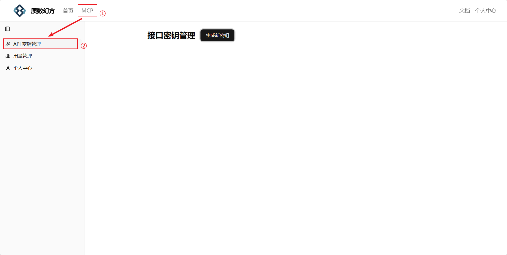

# **使用指南**

使用质数幻方提供的企业信息洞察 mcp 工具，精准探查到目标企业的工商信息、经营资质、风险情况等等，为您的AI接入最新的企业数据，省去网络搜索费token、企业总是关联不对的烦恼。

根据法律法规要求，您需要从我们的官网注册后再使用 mcp 服务，官网链接 [https://mcp.yidian.cn](https://mcp.yidian.cn/?ref=readme)，全部服务限时免费。

## **工具介绍**

1. ### **获取企业全称**

   - **函数名**：get_company_percise_name

   - **入参**：blur_name: 公司模糊名称。type:str

   - **出参**：推断的公司名称精确结果列表。这是因为用户提供的模糊名称关键字可能同时匹配多个公司名称。

     注意：在入参包括公司名称的工具（工商信息、司法信息、风险信息等）被调用前，必须先调用此工具，然后根据用户的上下文，选择一个最合理的返回值，作为最终的公司名称输入结果。调用完成该接口后，请**自动选择**你认为最合适的结果，并作为参数再次调用用户要求的接口。

   - **描述：**

     获取企业全称

     入参:

     blur_name: 公司模糊名称。type:str

     出参:

     推断的公司名称精确结果列表。这是因为用户提供的模糊名称关键字可能同时匹配多个公司名称。

     注意：

     在入参包括公司名称的工具（工商信息、司法信息、风险信息、知识产权信息、股东信息等）被调用前，必须先调用此工具，然后根据用户的上下文，选择一个最合理的返回值，作为最终的公司名称输入结果。

     调用完成该接口后，请**自动选择**你认为最合适的结果，并作为参数再次调用用户要求的接口。

2. ### **获取企业工商信息**

   - **函数名**：get_company_basic_info

   - **入参**：company_name: 公司精确名称。type:str

   - **出参**：企业工商信息,包括企业状态、曾用名、法人、统一信用代码、成立日期、注册资金与币种、行业、企业类型、地址、经营范围、经营期限自、经营期限至、核准日期、登记机关、注销日期、吊销日期等字段。

   - **描述：**

     获取企业工商信息

     入参:

     company_name: 公司精确名称。type:str

     出参:

     企业工商信息,包括企业状态、曾用名、法人、统一信用代码、成立日期、注册资金与币种、行业、企业类型、地址、经营范围、经营期限自、经营期限至、核准日期、登记机关、注销日期、吊销日期等字段。

3. ### **获取企业司法信息**

   - **函数名**：get_company_judical_info

   - **入参**：company_name: 公司精确名称。type:str

   - **出参**：企业司法信息,包括企业立案信息、法院公告、开庭公告、送达公告、执行信息、司法拍卖、破产信息等。

   - **描述：**

     获取企业司法信息

     入参:

     company_name: 公司精确名称。type:str

     出参:

     企业司法信息,包括企业立案信息、法院公告、开庭公告、送达公告、执行信息、司法拍卖、破产信息等，包含数量以及五条最新内容。

4. ### **获取企业风险信息**

   - **函数名**：get_company_risk_info

   - **入参**：company_name: 公司精确名称。type:str

   - **出参**：企业司法信息,包括企业经营异常风险、失信被执行人、工商严重违法、重大税收违法、欠税公告、限制高消费等。

   - **描述：**

     获取企业风险信息

     入参:

     company_name: 公司精确名称。type:str

     出参:

     企业司法信息,包括企业经营异常风险、失信被执行人、工商严重违法、重大税收违法、欠税公告、限制高消费等，包含数量以及五条最新内容。

5. ### **获取企业知识产权信息**

   - **函数名**：get_company_ip_info

   - **入参**：company_name: 公司精确名称。type:str

   - **出参**：企业知识产权信息,包括企业专利信息与商标信息等，包含数量以及十条最新内容。

   - **描述：**

     获取企业风险信息

     入参:

     company_name: 公司精确名称。type:str

     出参:

     企业知识产权信息,包括企业专利信息与商标信息等，包含数量以及十条最新内容。

6. ### **获取企业股东信息**
   - **函数名**：get_company_shareholder_info

   - **入参**：company_name: 公司精确名称。type:str

   - **出参**：企业股东信息,包括上市公司十大流通股（非上市公司为空）以及企业工商登记时的股东名称、持股比例、持股数量等。

   - **描述：**
     
     获取企业股东信息

     入参:

     company_name: 公司精确名称。type:str

     出参:

     企业股东信息,包括上市公司十大流通股（非上市公司为空）以及企业工商登记时  	的股东名称、持股比例、持股数量等。

7. ### **获取企业荣誉信息**
   - **函数名**：get_company_honor_info
   
   - **入参**：company_name: 公司精确名称。type:str

   - **出参**：企业荣誉信息,荣誉获得所在地区,荣誉名称、类型、级别、发布单位、发布日期、开始日期与结束日期等。
   
   - **描述：**

     获取企业荣誉信息
     
     入参:
     
     company_name: 公司精确名称。type:str
     
     出参:
     
      企业荣誉信息,荣誉获得所在地区,荣誉名称、类型、级别、发布单位、发布日期、开始日期与结束日期等。

8.  ### **获取企业上市信息与债券信息**
    - **函数名**：get_stk_company_basic_info

    - **入参**：company_name: 公司精确名称。type:str

    - **出参**：企业上市信息与债券信息,包括股票代码、股票简称、上市交易所、所属证监会行业以及公司发行的债券信息等。

    - **描述：**

       获取企业上市信息与债券信息
    
       入参:
    
       company_name: 公司精确名称。type:str
    
       出参:
    
       企业上市信息与债券信息,包括股票代码、股票简称、上市交易所、所属证监会行业以及公司发行的债券信息等。

9. ### **获取企业财务信息**
   - **函数名**：get_company_finance_info

   - **入参**：

     company_name: 公司精确名称。type:str

     start_year: 查询年份自。type:str

     end_year: 查询年份至。type:str

   - **出参**：企业财务信息,包括资产负债表、利润表以及现金流量表的所有财务字段等。

   - **描述：**

     获取企业财务信息
     
     入参:
     
        company_name: 公司精确名称。type:str
     
        start_year: 查询年份自。type:str
     
        end_year: 查询年份至。type:str
   
     出参:
   
        企业财务信息,包括资产负债表、利润表以及现金流量表的所有财务字段等。
   
     **注意:**  

     - 若用户未提及时间,则**默认start_year为2020,end_year为2024**。

10. ### **获取企业招聘信息**

    - **函数名**：get_company_job_info
    
    - **入参**：company_name: 公司精确名称。type:str
    
    - **出参**：企业岗位招聘信息，包括招聘时间、招聘数量、薪资、描述、教育、职位类型、岗位描述等。
    
    - **描述**：
    
      获取企业招聘信息

      入参:
    
      company_name: 公司精确名称。type:str

      出参:
      
      企业岗位招聘信息，包括招聘时间、招聘数量、薪资、描述、教育、职位			类型、岗位描述等。

11. ### **根据条件查询企业**

     - **函数名**：get_company_statistic_info
    
     - **入参**：
    
       industry: 公司所属行业,**为2017年国标行业分类**。type:str 
      
        entstatus: 公司状态,**若用户输入为存续,则输入存续,其他任何状态输入为其他**。type:str start_date: 成立时间自。type:str 
       
        start_date: 成立时间自。type:str 

        end_date: 成立时间至。type:str 
       
        district_code: 企业所属区域编码。type:str 
       
        page: 查询页数，**默认输入为1**。type:int
       
     - **出参**：企业岗位招聘信息，包括招聘时间、招聘数量、薪资、描述、教育、职位类型、岗位描述等。
    
     - **描述：**
    
       按条件查询企业信息
       
       入参:
       
       industry: 公司所属行业,**为2017年国标行业分类**。type:str 
      
       entstatus: 公司状态,**若用户输入为存续,则输入存续,其他任何状态输入为其他**。type:str start_date: 成立时间自。type:str 
       
       start_date: 成立时间自。type:str 
    
       end_date: 成立时间至。type:str 
       
       district_code: 企业所属区域编码。type:str 
       
       page: 查询页数，**默认输入为1**。type:int
       
       出参:
       
       企业信息,企业名称,统一社会信用代码,行业名称,企业类型,成立日期,住所（地址）等。
    
       **注意：**
       
       - industry为2017年国标行业分类,如C20,若用户输入行业描述,你需要找到最佳匹配的行业代码;start_date与end_date为企业成立时间的筛选条件,格式为YYYY-MM-DD;district_code为行政区域编码,如110000;查询页数,默认输入为1,若用户输入下一页,则页数加一。
       
       - 用户未提供的参数统一传入**空字符串**。
       
       - 调用该工具时无需调用get_company_percise_name工具。

## **可适配平台**

- 本地IDE：trae、cherry studio等常见客户端。

- 通用Agent调用：minimax Agent、扣子空间等。

## **安装部署**

### **官网注册**

不论是选用何种部署方式，都需要先在官网注册来获取唯一的密钥。

- 点击质数官网https://mcp.yidian.cn/api-keys
- 注册登录。

- 点击左上角的mcp产品，点击侧边栏的密钥

- 生成新秘钥，设置有意义的名称。

- 秘钥不论是否可见，可以直接点击密钥所在的位置来复制完整秘钥。或者是点击小眼睛展示，再从“一键使用”当中复制完整的json代码。

### **SSE版安装部署**

以trae为例

- 打开软件

- 打开聊天框（win系统快捷键Ctrl+U）

- 单击右上角齿轮，选择mcp-> 添加-> 手动添加

  
  
  
  
- 将从官网复制的json代码填入如图所示的区域。**需要保留最外层的"mcpServers"，不然会报错**。

- 点击确认，等待mcp工具连接成功。如果连接失败，请检查密钥是否正确，或者向我们反馈。

- 在trae中新建智能体，调用工具，艾特智能体开始对话 ~ 

### **STDIO版安装部署**

以本地下载为例

- 下载npm包
- 配置环境变量
- 将官网复制的json代码加入到客户端的配置文件（一般是xx.json）。

## **使用示例**

1. 查一下阿里巴巴的负责人
  
   a. 示例回复：

2. 查一下中国黄金最近的风险情况。
   
   a. 示例回复：

