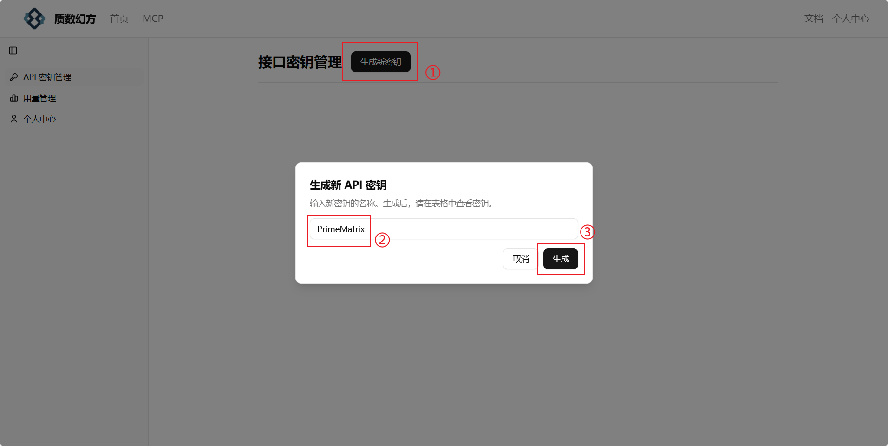
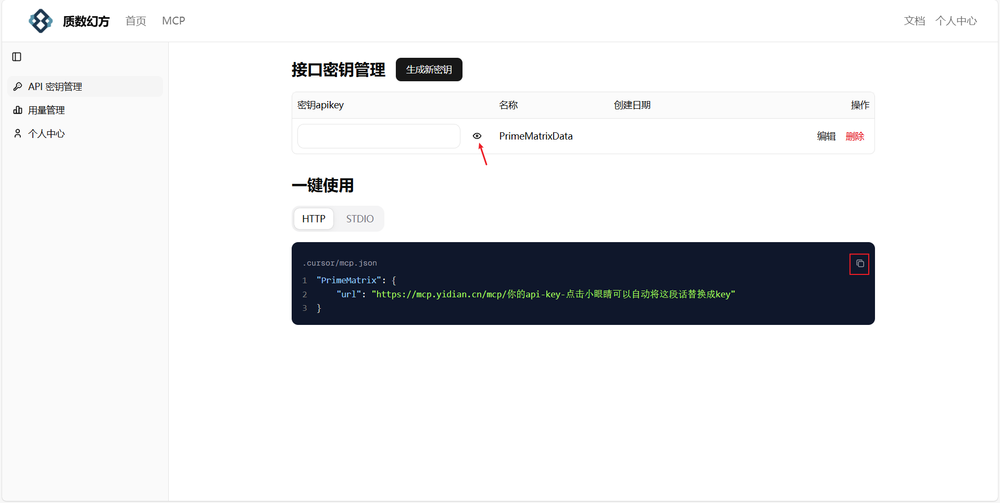
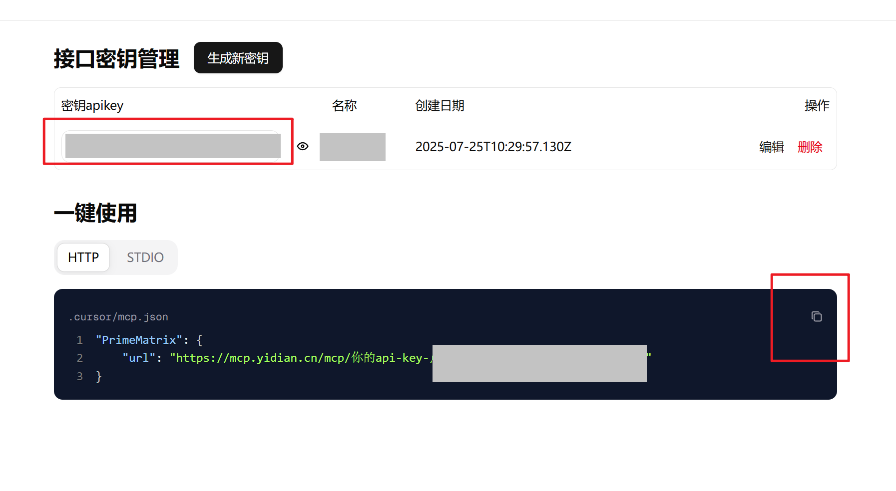
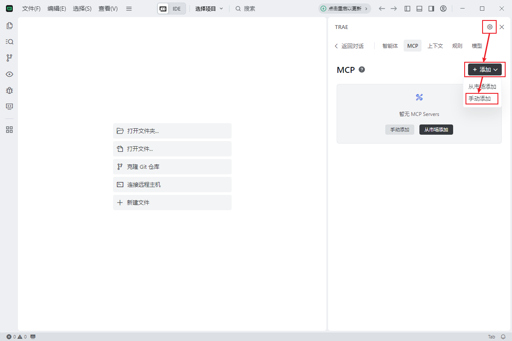
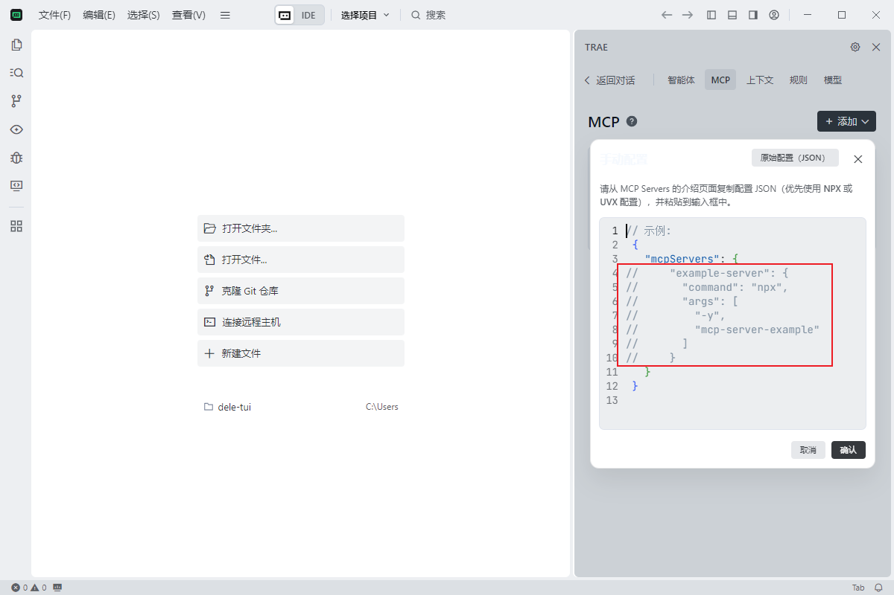
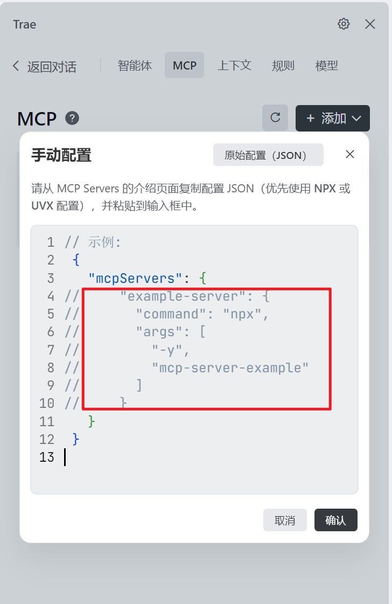
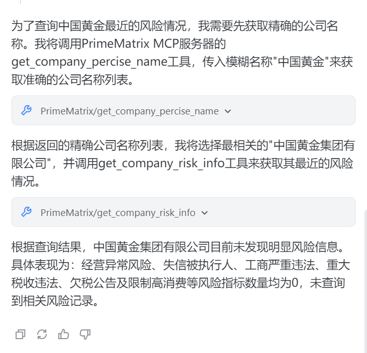

# 质数幻方-企业数据 MCP

使用质数幻方提供的企业信息洞察mcp工具，精准探查到目标企业的工商信息、经营资质、风险情况等等，为您的AI接入最新的企业数据，省去网络搜索费token、企业总是关联不对的烦恼。

根据法律法规要求，您需要从我们的官网注册后再使用mcp服务，官网链接 https://mcp.yidian.cn/ ,全部服务限时免费。

## **工具介绍**

质数幻方企业数据 MCP 提供了一系列简单易用的工具，帮助您快速获取企业信息：

- **获取公司精确名称**：当您只知道公司的大致名称时，这个工具能帮助您找到公司的准确注册全称。例如，输入“阿里”，它可以返回“阿里巴巴（中国）网络技术有限公司”。
- **获取企业工商信息**：提供公司的基本营业执照信息，包括企业当前状态（如存续、注销）、曾用名、法定代表人、统一社会信用代码、成立日期、注册资本、行业分类、企业类型、注册地址、经营范围、经营期限以及核准日期和登记机关等。
- **获取企业司法信息**：查询企业相关的法律诉讼信息，如立案、法院公告、开庭公告、送达公告、执行信息、司法拍卖和破产信息等，帮助您了解企业的司法风险。
- **获取企业风险信息**：揭示企业在经营过程中可能遇到的风险，包括经营异常、失信被执行人、严重违法、重大税收违法、欠税公告以及限制高消费等，助您全面评估企业状况。

## **可适配平台**

- 本地IDE：trae、cherry studio等常见客户端。
- 通用Agent调用：minimax Agent、扣子空间等。

## **安装部署**

### **官网注册**

不论是选用何种部署方式，都需要先在官网注册来获取唯一的密钥。

- 点击质数官网https://mcp.yidian.cn/api-keys
- 注册登录，可选绑定微信、设置密码，方便下次登陆。
- 点击左上角的mcp产品，点击侧边栏的密钥

- 生成新秘钥，设置有意义的名称。

- 秘钥不论是否可见，可以直接点击密钥所在的位置来复制完整秘钥。或者是点击小眼睛展示，再从“一键使用”当中复制完整的json代码。

### **SSE版安装部署**

以trae为例

- 打开软件
- 打开聊天框（win系统快捷键Ctrl+U）
- 单击右上角齿轮，选择mcp-> 添加-> 手动添加

  
- 
  
- 将从官网复制的json代码填入如图所示的区域。需要保留最外层的"mcpServers"，不然会报错。
  
- 点击确认，等待mcp工具连接成功。如果连接失败，请检查密钥是否正确，或者向我们反馈。
  
- 在trae中新建智能体，调用工具，艾特智能体开始对话 ~ 
  

### **STDIO版安装部署**

以本地下载为例

- 下载npm包
- 配置环境变量
- 将官网复制的json代码加入到客户端的配置文件（一般是xx.json）。

## **使用示例**

1. 查一下阿里巴巴的负责人
   a. 示例回复：

   
2. 查一下中国黄金最近的风险情况。
   a. 示例回复：

   